The [Alpine Lakes Home Court 100](https://www.summitpost.org/the-home-court-100/649859) is a somewhat niche peakbagging list for Seattle area summit enthusiasts. There is [an even more niche extension](https://www.peakbagger.com/list.aspx?lid=21307) of it which includes all subsummits which hit the 500 feet of prominence threshold. I spent this past weekend bagging 20 of those niche peaks. 

I didn't have to work on Friday, so I began my hike Thursday after work. After about a 1.5 hour drive from Seattle, I started my way up Little Kachess Beacon trail, a steep and at times loose single track trail leading to an observation tower about halfway along the ridge leading to Little Kachess peak. 

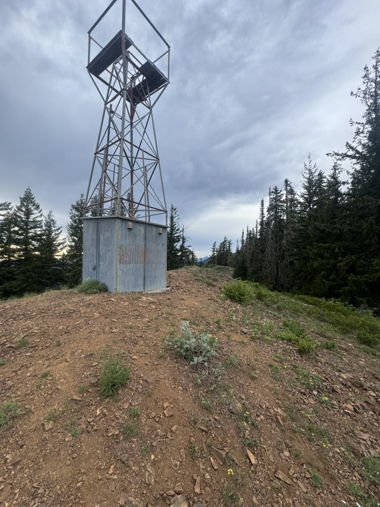

After about 1.5 miles more of easy bushwacking I summitted Little Kachess, then returned to the observation tower to hike down and set up camp for the night by the creek. The next morning started with some crummy washed out trails to get in a quick tag of French Cabin Mountain. Bad trails would be a theme of this trip. 

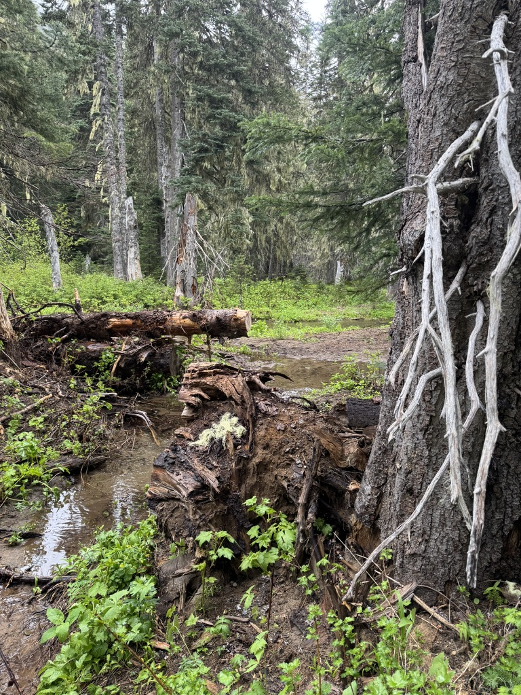

I hiked up the trail a ways further to a cluster of three peaks, Kachess Ridge, French Tongue and French Chin. I first bushwacked NW between Kachess Ridge and French Tongue. I was turned around at the base of French Tongue by steep, wet, chossy 5th class rock.

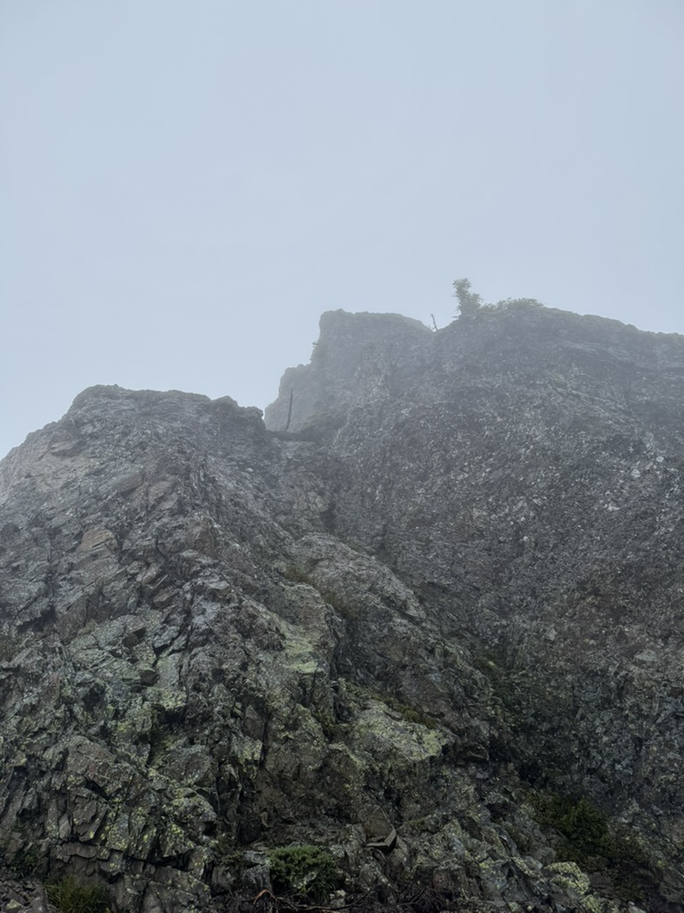

Bagging Kachess Ridge and French Chin after this was just some pretty relaxed heather slopes and third class root pulling. I don't really remember Hard Knox, Not Knox and Hard Cheese, but I bagged them next and it made me tired. 

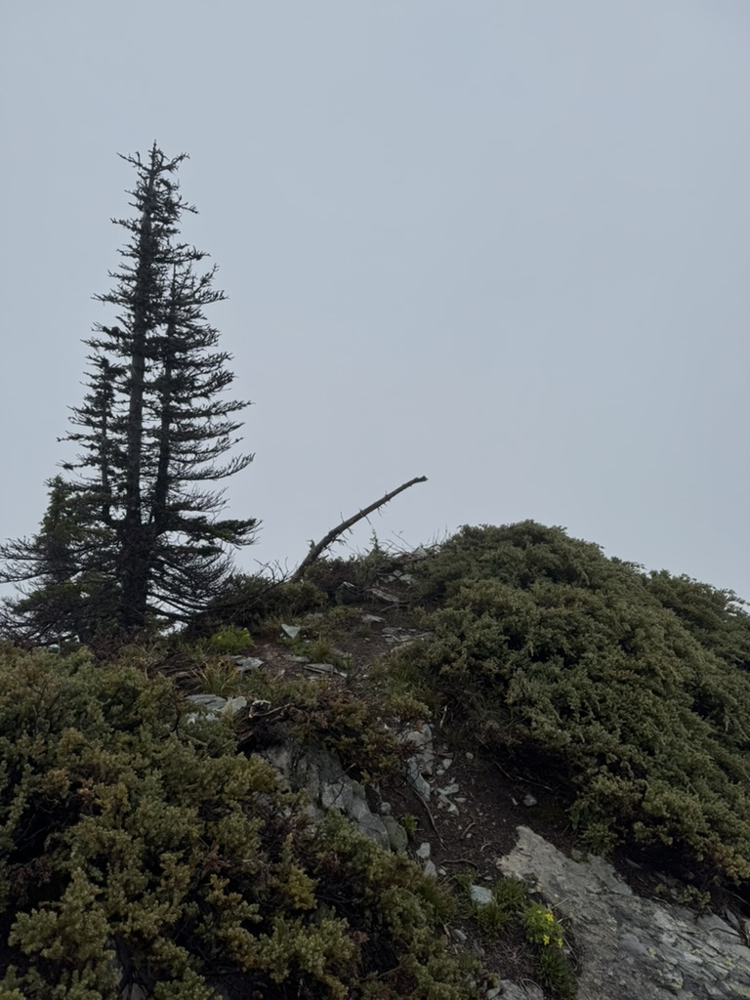

I'm not certain if doing this loop backpacking was easier than doing it in a day would be. I didn't carry the lightest setup (maybe ~15 pound base weight?), which I really noticed when I dropped it to scramble up peaks. Thorp Mountain was probably the best example of this. I was able to jog up the ~1/2 mile and 500 feet of vert easily, but the 1/2 mile after I got back to my pack after felt super nails.

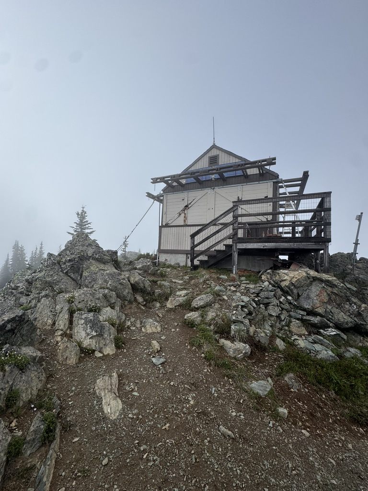

After Thorp, No Name Ridge and the uniquely named Peak 5357 remained. I was pretty toasted heading up Peak 5357, but it stopped raining (after about 12 hours of downpour) right as I started up, which made things okay enough to cruise into camp at Little Joe Lake feeling downright stoked.

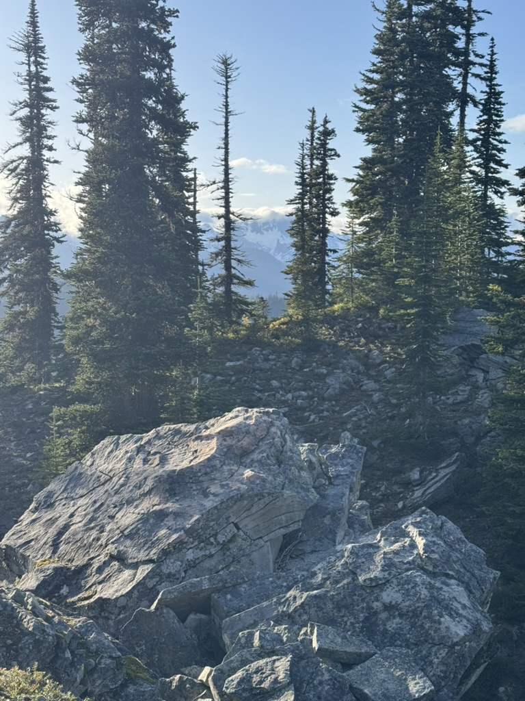

The next morning I walked up the west peak of Red Mountain in my puffy while brushing my teeth and eating breakfast. After cruising back down to pack up camp, I chugged some water and jogged up Red Mountain proper, along with its south and middle summits.  

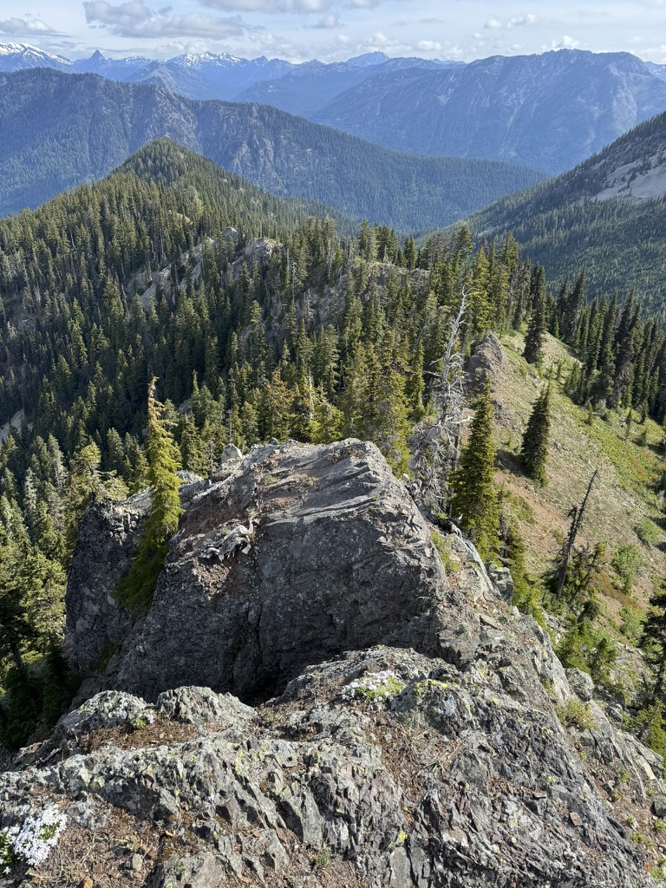

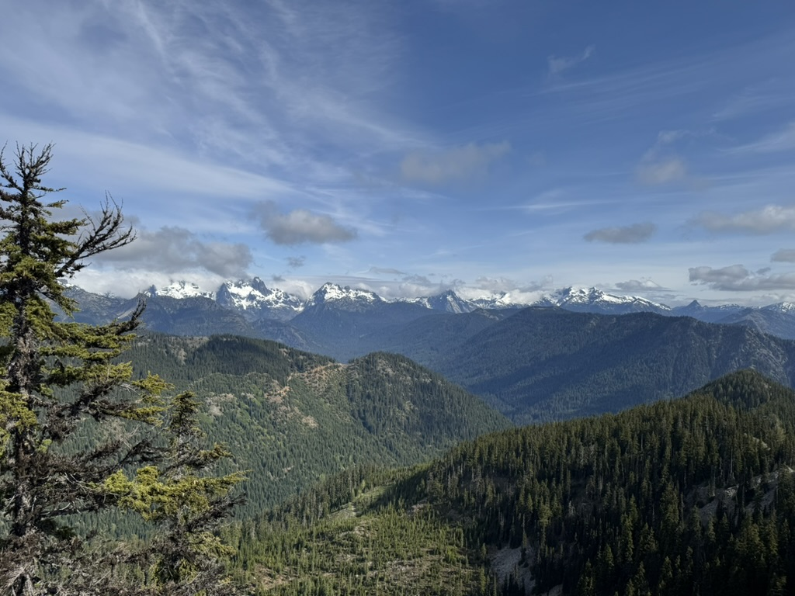

After 4 summits, several miles and thousands of feet of vert, I put on my backpack for the first time and walked the 2 miles down to Thorp Creek Road. From there I dropped my pack, and ran 6 miles and ~2k feet of vert to tag Fools Day Peak. It was easier than expected, but I was still proper tired.

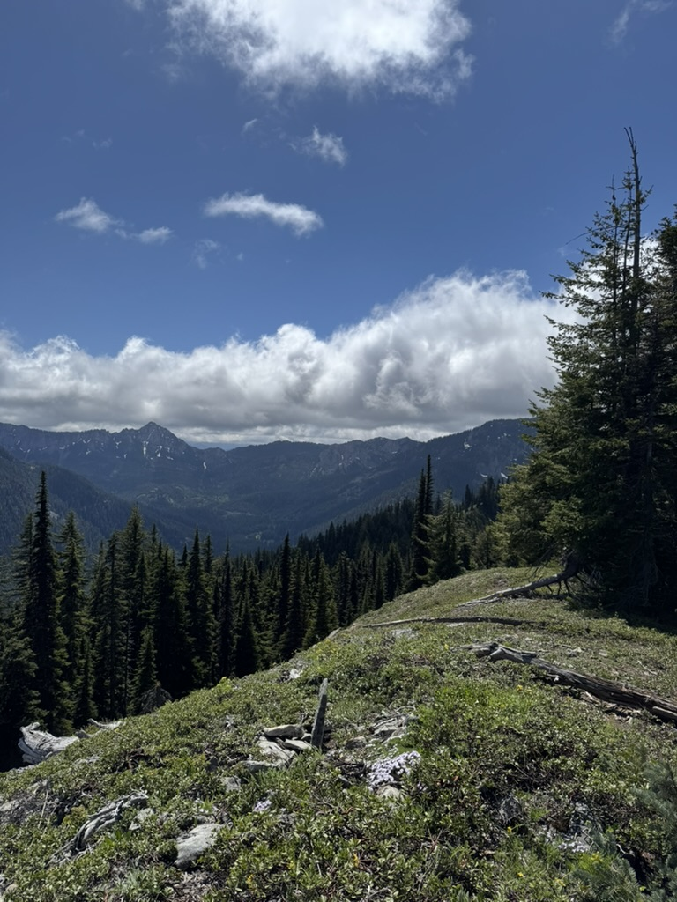

When I looked at my route the night before, I thought that I would be pretty much done by the time I jogged off fools day. A few miles of gravel road walking (highlights include being offered gummy worms from a jeep passing by and explaining my route to a man with a fedora, a rainbow tail, and a gun) followed, then the worst climb of the whole adventure. 

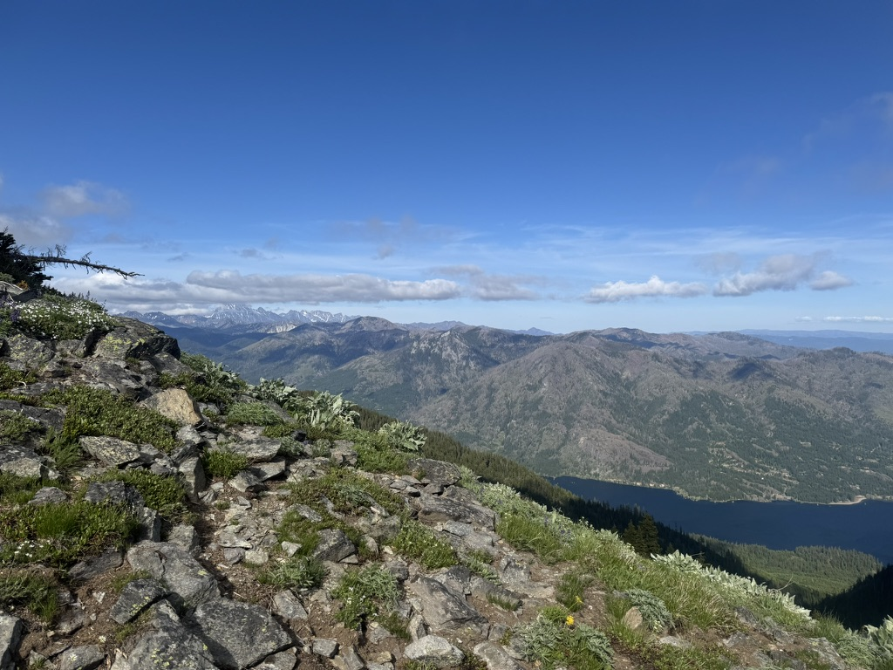

After this climb, I bagged the French Cabin North and South summits, along with a small peak called French Kiss. This was the last of the bushwacking and scrambling I had to do, so from here it was just following the trail back down. I also came into cell service here, so I called a few friends while meandering back to my car.

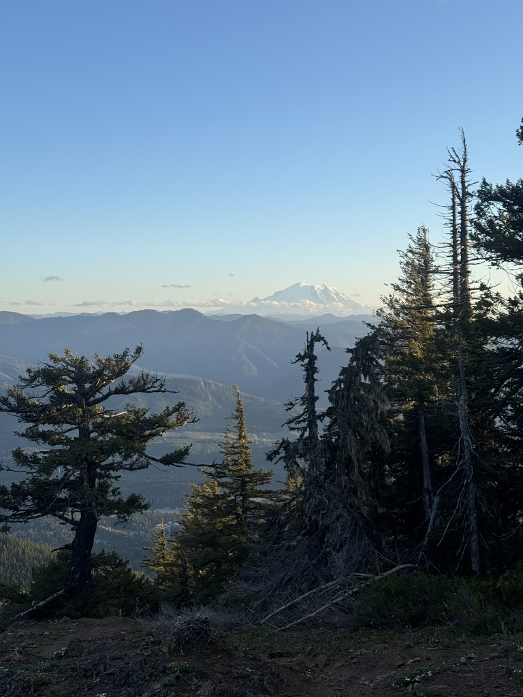

I was pretty stoked on this trip, I bagged 19 of the 20 peaks I set out to summit, and while I didn't record everything, my guess is that I went 45-50 miles and just about 20k feet of vertical.
