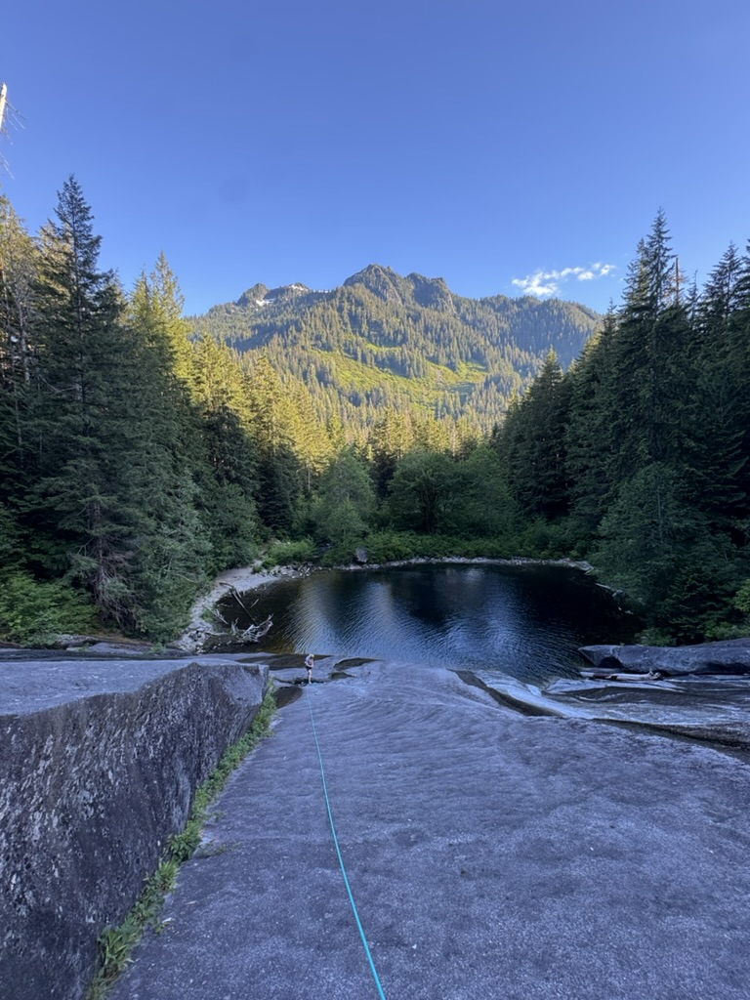

Recently I did two routes, both of which are quite easy, but I thought I'd write a little bit about doing them. On Thursday after work I ran 4 miles, climbed poppy's peril, a 5 pitch 5.7+ slab route in the middle fork valley. 

We simuled the route in 2 blocks because we underbrought micros, a part of the simuling system I'm pretty insistent upon using. We did it on a 30m lead line with a tag line, which made the running easier. We also only brought 15(?) draws, which was enough for us but mileage may vary. Jogging back the 4 miles after was relatively chill. 

The day after Poppy's, Friday, we did a route called Ice Cold Zach Daniels on the North Face of Silver star. It was a super relaxed day, but the climbing was amazing, and in an amazing setting. 

As a hike, the route was amazing. Taking your non-climber friends down this by just doing the loop in reverse and rapping would be fun. The climb itself was fun, but over too soon. Basically one pitch + faff.
